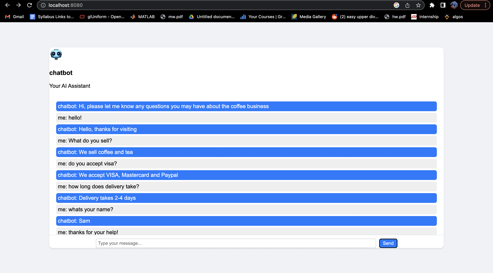

## Table of Contents

- [Project Overview](#project-overview)
- [Set Up](#set-up)
- [How to Run](#how-to-run)
- [How It Works](#how-it-works)
- [End Product](#end-product)

## Project Overview 
<!-- Your content for the project overview section goes here -->
Python-based chatbot using PyTorch and NumPy, implementing a feed-forward neural network architecture to facilitate natural language understanding and response generation.

## Set Up 
<!-- Your content for explaining how to run the project goes here -->
1. fork repository
2. install the following dependencies
   - pip install pytorch
   - pip install numpy
   - npm install express
   - install nodejs
## How To  
<!-- Your content for explaining how the project works goes here -->

## End Product 
<!-- Your content for showcasing the end product goes here -->
